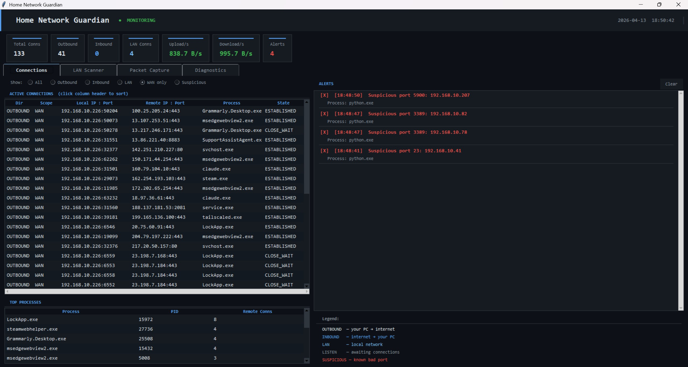

# 🛡 Home Network Guardian

A lightweight Windows network monitoring tool built with Python. Monitor your home network for suspicious activity, discover every device on your LAN, capture live packets, and get alerted to unusual traffic patterns — all in a single dark-themed desktop app.


## Screenshot



---

## Features

| Feature | Description |
|---|---|
| **Connection Monitor** | Live view of all inbound/outbound connections — process names, endpoints, direction, state — updated every 3 seconds |
| **LAN Scanner** | Ping-sweeps your subnet every 2 minutes, probes 26 common ports, reverse-DNS hostnames, guesses device type |
| **Packet Capture** | Captures live packets on any local interface via Scapy; BPF filter support; save to `.pcap` |
| **Alerts** | Suspicious ports, high connection counts, high upload rates, new/unknown devices, risky open services |
| **Persistence** | Discovered devices and alert history survive app restarts; returning devices are not re-flagged as new |
| **Logging** | Rotating log file at `data/guardian.log` (1 MB × 3 backups) |
| **Context menus** | Right-click any row to copy IPs, open IP info, jump to a targeted packet capture, or open a device in the browser |
| **Filtering & sorting** | Filter connections by direction, scope (LAN/WAN), or suspicious status; click any column header to sort |

---

## Requirements

- Windows 10 or 11
- Python 3.9 or later
- [psutil](https://pypi.org/project/psutil/) — connection and I/O monitoring
- [scapy](https://scapy.net/) *(optional)* — required for the Packet Capture tab
- [Npcap](https://npcap.com/) *(optional, Windows)* — required by Scapy for raw packet access

---

## Installation

### 1. Install Python

Download from [python.org](https://www.python.org/downloads/). During install, check **"Add Python to PATH"**.

### 2. Clone the repository

```
git clone https://github.com/YOUR_USERNAME/home-network-guardian.git
cd home-network-guardian
```

### 3. Install dependencies

**Minimum (Connection Monitor + LAN Scanner):**

```
pip install psutil
```

**Full (including Packet Capture):**

```
pip install psutil scapy
```

Then install **[Npcap](https://npcap.com/)** — a free, one-time Windows driver install required by Scapy for raw packet access.

### 4. Run the app

```
cd home-network-guardian
python main.py
```

> **Tip:** For full visibility into all connections and packet capture, right-click your terminal and choose **Run as administrator**. The app works without admin rights but may miss some system-level connections.

---

## Project Structure

```
home-network-guardian/
├── main.py               ← entry point
├── core/
│   ├── alerts.py         ← Alert model
│   ├── capture.py        ← PacketCapture (Scapy backend)
│   ├── logger.py         ← logging setup (rotating file + console)
│   ├── models.py         ← LanDevice, Connection data classes
│   ├── monitor.py        ← NetworkMonitor background thread
│   ├── persistence.py    ← JSON persistence (devices, alerts)
│   ├── scanner.py        ← LanScanner background thread
│   └── utils.py          ← network helpers and constants
├── ui/
│   └── app.py            ← Tkinter GUI (4-tab dark-theme app)
├── data/                 ← created at runtime
│   ├── devices.json      ← persisted LAN device records
│   ├── lan_alerts.json   ← persisted LAN alert history
│   └── guardian.log      ← rotating application log
└── tests/
```

---

## Usage

### Connections Tab

Shows every active network connection on this PC in real time (updates every 3 seconds).

| Column | Meaning |
|---|---|
| Dir | OUTBOUND (your PC called out), INBOUND (something called in), LISTEN |
| Scope | WAN (internet), LAN (local network) |
| Local IP : Port | Which port on your machine is involved |
| Remote IP : Port | The other end of the connection |
| Process | Which program owns the connection |
| State | ESTABLISHED, TIME_WAIT, etc. |

Use the filter bar to narrow down to **Inbound**, **WAN only**, or **Suspicious** connections. Click any column header to sort. Right-click any row for copy, IP info, and capture shortcuts.

### LAN Scanner Tab

Scans your entire local subnet every 2 minutes — or click **Scan Now** for an immediate pass.

- Pings every address in your subnet to find live hosts
- Probes 26 common service ports per host
- Reverse-DNS lookup for friendly hostnames
- Guesses device type (Windows PC, Printer, IP Camera, Router, IoT, …)
- **New device alert** — anything not seen since the last run
- **Risky port alert** — RDP (3389), VNC (5900), Telnet (23), SMB (445/139) flagged as high risk
- Discovered devices are saved to `data/devices.json` and restored on the next launch — so a device only appears as "new" the very first time it is discovered

Right-click any device row to:
- Copy its IP or hostname
- Open IP info / Whois in the browser
- Open it directly in the browser (if HTTP/HTTPS detected)
- Jump to a targeted packet capture for that host

### Packet Capture Tab

Captures live packets on any local network interface.

1. Select an interface from the dropdown (auto-detected on tab open)
2. Optionally enter a **BPF filter** (e.g. `tcp port 443`, `host 192.168.1.1`, `udp`)
3. Press **▶ Start** — packets appear in real time, colour-coded by protocol
4. Press **■ Stop** when done, then **Save .pcap** to write a Wireshark-compatible file

> Requires Scapy + Npcap, and Administrator privileges on Windows.

**Tip:** Right-click any connection in the Connections or LAN Scanner tab and choose **"Capture traffic for this host"** to jump here with the BPF filter pre-filled.

### Alerts

Both the Connections and LAN Scanner tabs have their own alert panel. Alerts are colour-coded by severity:

| Colour | Severity | Examples |
|---|---|---|
| 🔴 Red | Danger | Suspicious port connection, risky service open (RDP, VNC) |
| 🟡 Amber | Warning | New device on network, high upload rate (> 50 MB/min) |

Alert history persists across restarts (up to 200 entries per source).

### Diagnostics Tab

Shows a timestamped log of environment info and any runtime errors. The same log is written to `data/guardian.log` (rotated at 1 MB, 3 backups kept).

---

## Limitations

- The LAN Scanner can see *what* devices are on your network and *what ports they have open*, but cannot see the content or volume of traffic from other devices. For per-device traffic you need router-level access or a network tap.
- Packet capture on other devices' traffic requires either a managed switch with port mirroring, or a device acting as the network gateway.
- Scanning your own network is legal and normal. Do not use this tool to scan networks you do not own or have permission to monitor.

---

## License

MIT — see [LICENSE](LICENSE)
